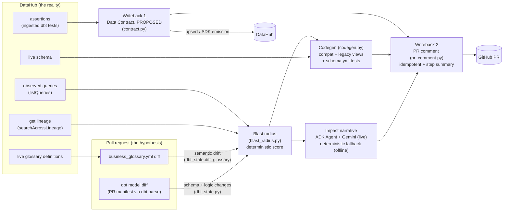

# Architecture

One PR-triggered pipeline, two writebacks, three surfaces. Design
rationale in `SPEC.md`; decisions in `adr/`.

## How DataHub is used (integration matrix)

| DataHub piece | Where | Why this path |
|---|---|---|
| **Agent Context Kit** (`build_google_adk_tools`, read-only) | ADK narrative agent, live mode | Track 1's named integration; full read surface (lineage, queries, assertions, schema, search) in-process |
| **MCP Server** (`mcp-server-datahub`) | Interactive surface: `.mcp.json` for judges/devs pointing their own agents at the catalog | MCP is the right transport for external agents; redundant inside the CI process (ACK covers it) |
| **GraphQL** (direct) | Deterministic pipeline reads + `upsertDataContract` writeback | Needs no LLM; covers what the Kit doesn't expose (contract upsert, sibling-aware assertion lookup) |
| **Ingestion** (dbt + business-glossary sources) | One-time prep, `scripts/ingest_all.sh` | dbt tests → assertions (contract backing); glossary versions (semantic drift baseline) |
| **SDK aspect emission** | Contract status stamping + fallback | `dataContractStatus` state=PENDING + provenance |

## Two invariants everything hangs off

1. **DataHub only ever reflects reality.** The PR diff is read locally as
   the *proposal*; DataHub is read as the *live truth* (schema, lineage,
   queries, glossary). Nothing hypothetical is ever ingested.
2. **The LLM narrates; it never scores and never authors merged code.**
   Severity scoring and codegen are deterministic and unit-tested; the ADK
   agent improves prose in live mode and vanishes harmlessly offline
   (ADR-0002, ADR-0007).

## Components

| Path | Role |
|---|---|
| `action.yml` | **Reusable composite action** — any dbt repo adopts the guardian with one `uses:` block (inputs: dbt project dir, DataHub URL/token, warehouse coords, platform, strict). No hosting: runs on the consumer's Action runner. |
| `.github/workflows/downstream-impact-guardian-check.yml` | This repo dogfooding its own action on PRs touching `dbt_demo_project/**`. Fork-safe (ADR-0007). |
| `agent/main.py` | Orchestrates steps 1–6; CLI contract `--pr-number N`; exit 0 unless `--strict` |
| `agent/dbt_state.py` | Detection #1/#2: committed prod manifest (ADR-0006) vs PR manifest — column diff, rename heuristic, normalized-SQL logic diff. Detection #3: PR glossary yml vs live DataHub terms |
| `agent/datahub_client.py` | `LiveDataHubClient` (GraphQL) / `FixtureDataHubClient` (committed JSON), same protocol |
| `agent/blast_radius.py` | Lineage + query cross-reference; inspectable additive scoring → LOW/MEDIUM/HIGH/CRITICAL |
| `agent/contract.py` | Writeback 1: upsert → SDK-emission fallback, PROPOSED provenance (ADR-0003) |
| `agent/codegen.py` | Writeback 2 payload: deterministic `*_compat` / `*_legacy` views, live schema as the old-shape authority, `requires_human` flag for unmappable cases |
| `agent/adk_agent.py` | Google ADK `Agent` (gemini-flash-latest); tools from the first-party **DataHub Agent Context Kit** (`build_google_adk_tools`, read-only) plus a local observed-queries tool; local wrappers as fallback. Narrative only |
| `agent/pr_comment.py` | Renders + posts one idempotent comment (HTML marker), mirrors to `$GITHUB_STEP_SUMMARY` |
| `dbt_demo_project/` | fiction-retail: seeds → staging → `fct_orders` → `revenue_daily`; glossary + ingestion recipes (ADR-0001, ADR-0005) |
| `examples/generated/` | Real output of a run against `demo/breaking-change` |
| `tools/demo_ui/` | Stretch goal only — untouched, per CLAUDE.md |

## Modes

| | live | offline (fixtures) |
|---|---|---|
| Trigger condition | GMS URL + token present | any secret missing (e.g. fork PR) |
| Lineage/queries/schema/glossary | DataHub GraphQL | `agent/fixtures/*.json` |
| Contract | upsert → SDK fallback | exact payload recorded in the comment |
| Narrative | ADK + Gemini, deterministic fallback | deterministic |
| PR comment | posted/updated | rendered; step summary always written |

## Judge paths (two)

1. **Watch the bot work**: open a PR from `demo/breaking-change` → `master`
   in this repo (read access suffices; no fork). The branch stages one
   schema break, one silent metric redefinition, one glossary drift.
   Repo-internal CI is green — only the cross-system context in DataHub
   reveals the breakage. That asymmetry is the whole pitch.
2. **Bring your own agent**: point Claude/Cursor at the demo catalog via
   `mcp-server-datahub` (`.mcp.json` ships preconfigured) and interrogate
   the same lineage, glossary, and PROPOSED contract the guardian used.

## Adoption (any dbt repo)

`action.yml` packages the whole pipeline as a composite GitHub Action —
one `uses:` block, secrets for DataHub/Gemini, no hosting anywhere (the
consumer's runner is the compute). This repo dogfoods its own action.

## Deliberate limitations (honest list)

- Rename detection is a 1-removed/1-added heuristic; anything more
  ambiguous is reported as remove+add and flagged for a human.
- `type_changed` detection is limited because dbt yml rarely carries
  `data_type`; the live-schema path is where that would come from.
- Prod-manifest refresh is a script, not a main-branch workflow — the
  obvious next automation.
- Live-mode gaps still open: `listQueries` returns nothing until query
  usage is ingested (fixtures carry the story meanwhile), and the ADK
  narrative needs a `GOOGLE_API_KEY` secret to run.

## Live verification (2026-07-15, local OSS quickstart)

The full loop ran against a real instance: dbt built in BigQuery
(`agent-era`), glossary + models + test-assertions ingested, then the agent
in live mode — lineage traversal, sibling dedupe, glossary drift, and
`upsertDataContract` + PENDING status aspect all confirmed working
(contract inspectable via OpenAPI). Findings that changed code: assertions
live on the dbt sibling urn (client now merges both siblings), the upsert
input rejects unknown keys (provenance moved to a status aspect), and
`dbt docs generate` overwrites `run_results.json` (run tests last before
ingesting).
