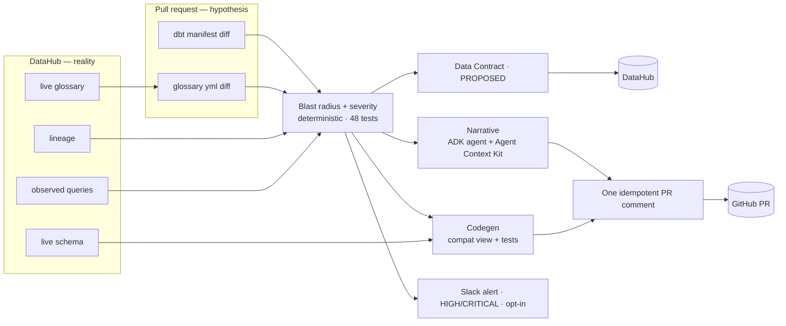
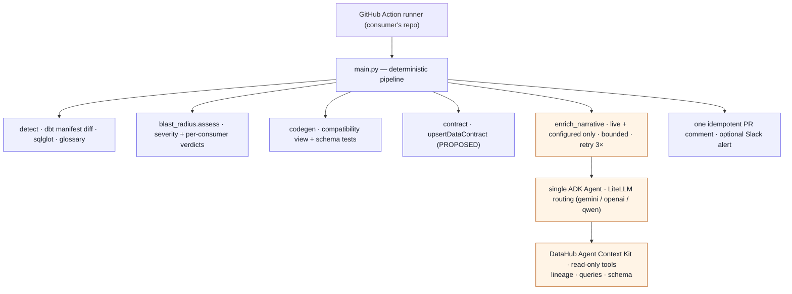
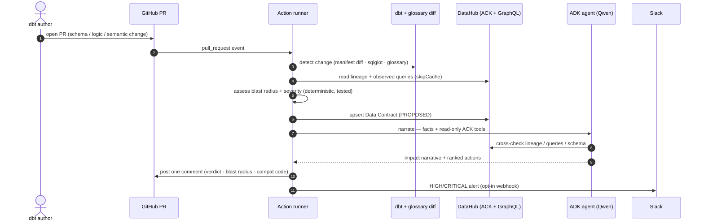

# Diagrams

Rendered inline by GitHub. Screenshot any panel for the Devpost gallery, or open
the [interactive walkthrough](https://claude.ai/code/artifact/c578039e-bce6-4330-8396-cb48b739e7c6)
for the same architecture with links to every technology.

## 1 · System architecture — hypothesis vs. reality

The pull request is a *hypothesis*; DataHub is *reality*. The agent reads the
catalog for what's live and the dbt/glossary diff for what's proposed — and
never ingests the PR's hypothetical state.

## 2 · Agent topology — deterministic core, one narrating agent

A flat topology on purpose. The deterministic pipeline (`main.py`) owns control
flow and every judgment; a single ADK agent adds the narrative and cross-checks
facts through read-only DataHub tools. The LLM never scores and never authors
merged code.

## 3 · Sequence — one PR, end to end

## 4 · One-page infographic

The polished single-image summary lives in the
[interactive walkthrough](https://claude.ai/code/artifact/c578039e-bce6-4330-8396-cb48b739e7c6)
(architecture + the three detectors + precision ladder + two writebacks, with
headline numbers). Screenshot its hero + architecture section for a Devpost cover,
or use `slide-arch.png` here.
